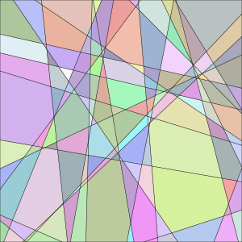

Regioncam - visualize linear regions in neural networks
=========

Regioncam is a rust library and python package for visualizing linear regions in a neural network.
Regioncam works by tracking the output of all neural network layers in the regions where these outputs are linear. The inputs are in a 1 or 2 dimensional space.

Usage from rust
-----

```rust
use std::fs::File;
use rand::prelude::*;
use regioncam::{NNBuilder, Regioncam, RenderOptions, nn::Linear};

fn main() -> std::io::Result<()> {
    // Create a regioncam object, with the region [-1..1]^2
    let mut rc = Regioncam::square(1.0);
    // Apply a linear layer
    let mut rng = SmallRng::seed_from_u64(42);
    let layer1 = Linear::new_uniform(2, 30, &mut rng);
    rc.add(&layer1);
    // Apply a relu activation function
    rc.relu();
    // Write to an svg file
    let render_options = RenderOptions::default();
    let mut file = File::create("example.svg")?;
    rc.write_svg(&render_options, &mut file)?;
    // Inspect regions
    println!("Created {} regions", rc.num_faces());
    println!("Face with the most edges has {} edges",
        rc.faces().map(|face| rc.vertices_on_face(face).count()).max().unwrap()
    );
    Ok(())
}
```

Produces the output
```
Created 169 regions
Face with the most edges has 7 edges
```
And creates the following svg file:   


Since this is a randomly initialized neural network, the linear regions are also placed randomly.

Usage from python
-----

The python wrapper is intended to be the main way to use Regioncam, see [regioncam-python](https://github.com/twanvl/regioncam/tree/main/regioncam-python) for the details.

Algorithm
---------

Regioncam is similar to [Splinecam](https://github.com/AhmedImtiazPrio/splinecam/), but the algorithm is different.

Regioncam maintains a [halfedge datastructure](https://en.wikipedia.org/wiki/Doubly_connected_edge_list) of linear regions, which is updated when a piecewise activation function is applied.
It also stores the activations $x^{(l)}$ for every vertex on every layer.
The activations for faces are stored as a $\mathbb{R}^{3\times D}$ matrix $F$, where the activation of an input point $u$ in that face is given by 
 $x^{(l)} = f(u) = (u_1, u_2, 1) F$.

A ReLU activation is applied one dimension at a time:
 * Split each edge $(u,v)$ with $x_u^{(l)} < 0$ and $x_v^{(l)} > 0$, by adding a new vertex $w$ where $x_w^{(l)} = 0$. This is a simple linear interpolation between $u$ and $v$.
 * Then all regions/faces are split by adding edges between vertices with a 0 activation.

For max pooling activations:
 * Split each edge where the argmax changes, such that all points at which the argmax changes are on a vertex.
   In general the argmax is the set of pooled dimensions that are equal to the maximum value. In this new vertex this set has at least two elements, that is, if $\text{argmax} x_u = \{ k_u \}$ and $\text{argmax} x_v = \{ k_v \}$, then we add a new vertex $w$ on the edge with $\text{argmax} x_w = \{ k_u, k_v \}$.
 * Split faces by adding interior edges between vertices with the same argmax.
 * We again do this one dimension at a time, keeping track of the maximum for all pooled dimensions so far.
 * This can result in adding unecessary vertices and edges. These are then cleaned up afterwards by merging faces with the same argmax.

When rendering images, the color of each face is based on a hash of the activation pattern. This means that the colors remain stable during training.