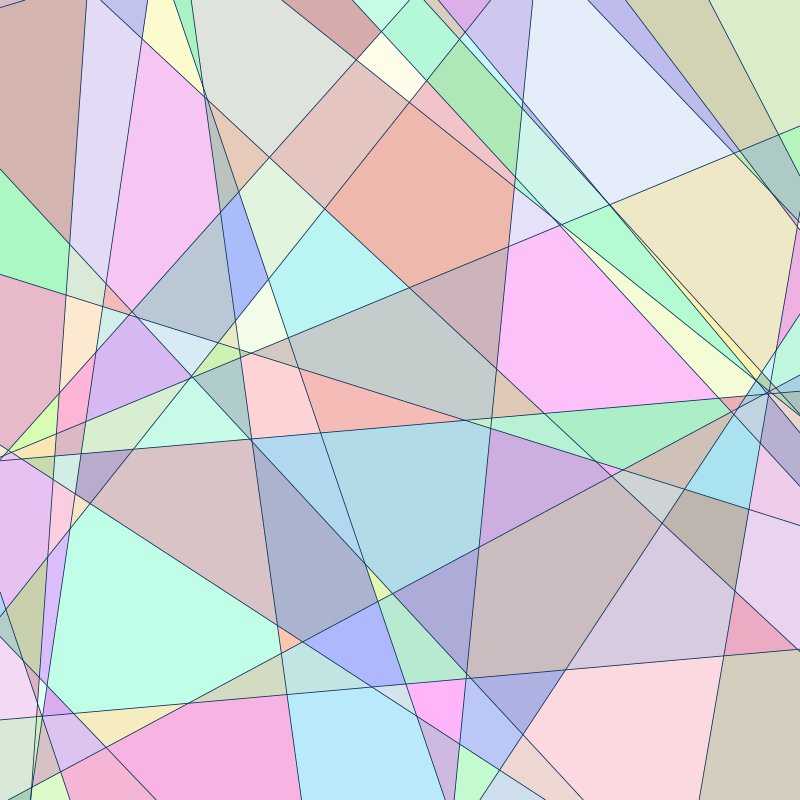

Python interface for Regioncam
=========

Regioncam is a rust library and python package for visualizing linear regions in a neural network.
Regioncam works by tracking the output of all neural network layers in the regions where these outputs are linear. The inputs are in a 1 or 2 dimensional space.

Usage
-----

```python
import regioncam
import numpy as np

# Create a regioncam object, with the region [-1..1]^2
rc = regioncam.Regioncam(size=1)
# Apply a linear layer
rng = np.random.default_rng()
weight = rng.standard_normal((2, 30), dtype=np.float32)
bias = rng.standard_normal((30,), dtype=np.float32)
rc.linear(weight, bias)
# Apply a relu activation function
rc.relu()
# Write to svg
rc.write_svg("example.svg")
# Inspect regions
print(f"Created {rc.num_faces} regions")
for face in rc.faces:
    print(face.vertex_ids)
```

Produces the following svg file:  


Arrays passed to regioncam, such as weights and biases must be numpy arrays or torch tensors with dtype float32.

Regioncam also has limited support for torch nn layers:

```python
net = torch.nn.Sequential(
    torch.nn.Linear(2,30),
    torch.nn.ReLU(),
    torch.nn.Linear(30,30),
    torch.nn.ReLU(),
)
rc.add(net)
```

See `examples/` for an example of visualizing a trained torch network.

The following layer types are supported:
* ReLU
* LeakyReLU
* Linear
* Sequential
* Identity
* Dropout (treated as Identity)
* residual

Installation
---------

The regioncam python package can be installed with pip,
```
pip install regioncam
```
To compile locally, use
```
pip install ./regioncam-python
```
or
```
cd regioncam-python
maturin build --release
```

More information
---------

Regioncam is similar to [Splinecam](https://github.com/AhmedImtiazPrio/splinecam/), but the algorithm is different.
See [the github repository](https://github.com/twanvl/regioncam/) for the details.